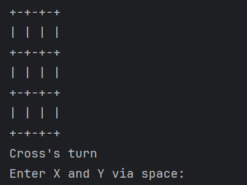
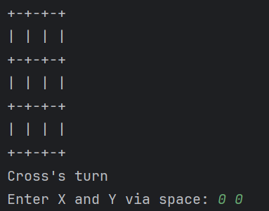
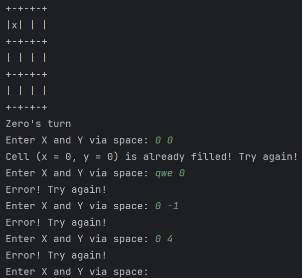
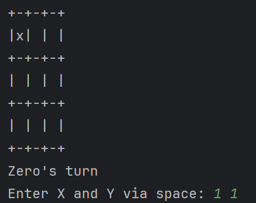
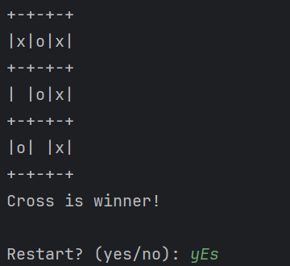
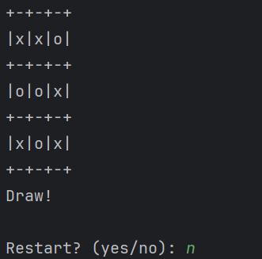

# `tic-tac-toe-py-console`

A classic Tic-Tac-Toe console game.

## Features

*   Classic 3x3 grid gameplay
*   Turn-based input for two players (X and O)
*   Input validation (checking for correct coordinates and cell availability)
*   Real-time win condition checks (rows, columns, diagonals)
*   Draw condition detection
*   Option to restart the game after it ends


## Game Process

The game begins by displaying an empty game board and a message indicating the active player.



The active player enters coordinates separated by a space, and then the turn passes to the other player.



If the active player enters incorrect data, an error message is displayed, and the player is prompted to try again.



After each move, the current game board and status are printed, and the game waits for the next player to enter the coordinates of their chosen cell.



When a player wins, a corresponding message is printed, and the user is prompted to restart the game.



When a draw occurs, a corresponding message is displayed, and the user is also prompted to restart the game.




## Installation and Launch

### Prerequisites

- Python 3.13 or higher
- Poetry (optional) - [installation guide](https://python-poetry.org/docs/#installation)

### Running the game

1. Clone repository:
    ```bash
    git clone https://github.com/KATEHOK/tic-tac-toe-py-console.git
    cd tic-tac-toe-py-console
    ```

2. Install dependencies using Poetry (optional):
    ```bash
    poetry install
    ```

3.  Run:
    ```bash
    # with poetry   
    poetry run python main.py
    
    # without poetry (require Python 3.13^)
    python main.py
    ```


## Project structure

[`tic-tac-toe-py-console/`](https://github.com/KATEHOK/tic-tac-toe-py-console/):
- [`main.py`](https://github.com/KATEHOK/tic-tac-toe-py-console/blob/main/main.py)               - Main game logic and entry point
- [`pyproject.toml`](https://github.com/KATEHOK/tic-tac-toe-py-console/blob/main/pyproject.toml) - Poetry configuration and dependencies
- [`poetry.lock`](https://github.com/KATEHOK/tic-tac-toe-py-console/blob/main/poetry.lock)       - Locked dependencies versions
- [`poetry.toml`](https://github.com/KATEHOK/tic-tac-toe-py-console/blob/main/poetry.toml)       - Poetry local configuration
- [`README.md`](https://github.com/KATEHOK/tic-tac-toe-py-/blob/main/README.md)           - This file
- [`LICENSE`](https://github.com/KATEHOK/tic-tac-toe-py-console/blob/main/LICENSE)               - License file
- [`.gitignore`](https://github.com/KATEHOK/tic-tac-toe-py-console/blob/main/.gitignore)         - Git ignore rules
- [`img/`](https://github.com/KATEHOK/tic-tac-toe-py-console/blob/main/img)                      - Directory containing screenshots